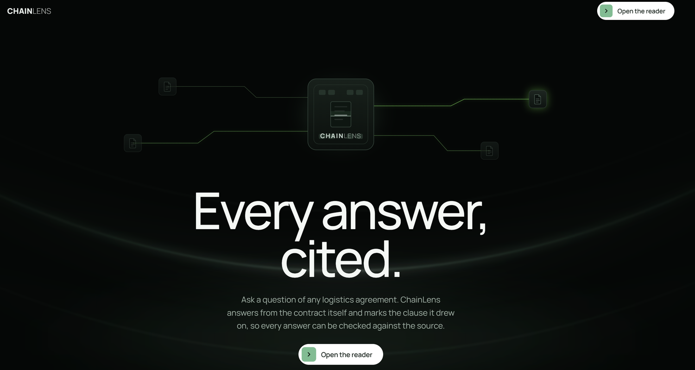
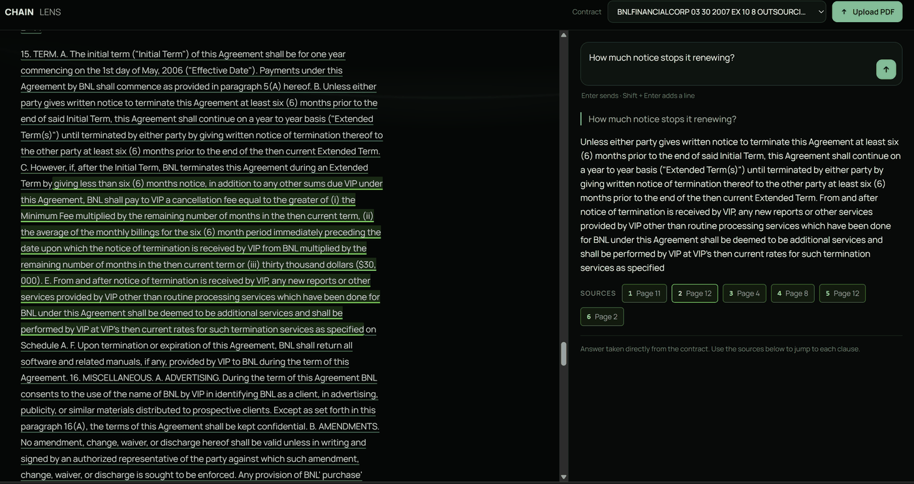
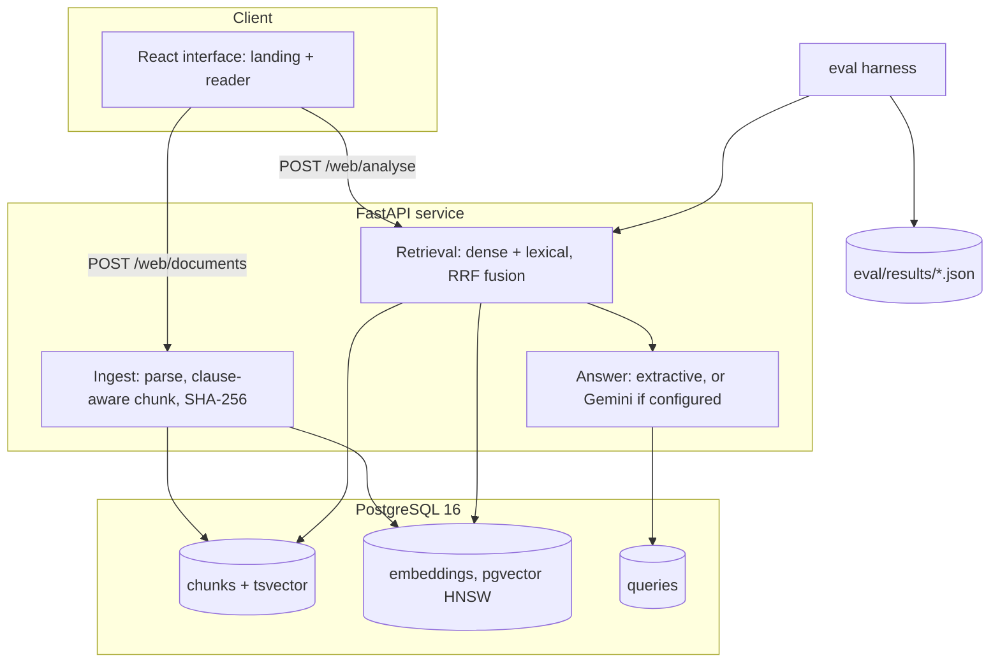

# ChainLens

[](https://github.com/swapnil5053/ChainLens/actions/workflows/ci.yml)
[](pyproject.toml)
[](docs/RETRIEVAL.md)


**Ask a logistics contract a question in plain language and get the answer back with the exact character span of the clause it came from.** ChainLens retrieves and quotes — it does not advise.



Freight, supply and distribution agreements run to dozens of dense pages, and the clause that governs your question is never where you expect it.



Every source chip points at an exact character range, so the passage lights up in the contract beside it.

**Stack:** Python 3.12 · FastAPI · PostgreSQL 16 + pgvector (HNSW) · React · reciprocal-rank-fusion retrieval, evaluated in CI.

## Results

Retrieval is measured against a fixed set of 110 questions drawn from 29 real agreements and 20 clause categories, taken from CUAD. The table below is generated by `python -m eval.report` from committed JSON, and CI fails the build if Recall@6 drops more than two points.

<!-- eval:headline:start -->
Chunking fixed at `clause-aware`, retrieval scoped to one document.

| retrieval | Recall@3 | Recall@6 | Recall@10 | MRR | p50 ms |
|---|---|---|---|---|---|
| dense (pgvector cosine) | 0.565 | 0.673 | 0.728 | 0.604 | 81.8 |
| MMR (lambda 0.5) | 0.395 | 0.475 | 0.587 | 0.573 | 82.3 |
| lexical (Postgres FTS, ts_rank_cd) | 0.489 | 0.663 | 0.726 | 0.528 | 1.7 |
| RRF fusion (dense + lexical, k=60) | 0.582 | 0.677 | 0.756 | 0.601 | 81.1 |
| RRF fusion + glossary query expansion | 0.586 | 0.690 | 0.770 | 0.624 | 81.2 |
| RRF fusion + cross-encoder rerank | -- | -- | -- | -- | -- |

Cells marked `--` were not measured:
- cross-encoder weights could not be loaded (3 configurations)

Generated by `python -m eval.report` from 19 files in `eval/results/`. Runs produced at commit `b48878f962e7` (working tree dirty at run time) on 2026-08-02T08:14:54+00:00.

Dataset `eval/datasets/golden.jsonl`, sha256 `4ac8d01460a836c4`, 110 questions across 29 documents and 20 clause categories. Embedding provider `lsa-tfidf-svd-384` (dim 384); Postgres 16.2.

The embedding provider is not `bge-small-en-v1.5`: the model hub was unreachable in the environment these numbers were produced in, so a corpus-fitted LSA model was used instead. Absolute values are a floor for the architecture, not a claim about a modern encoder.
<!-- eval:headline:end -->

The full grid across three chunking strategies, the latency decomposition and the extraction accuracy are in [`docs/RETRIEVAL.md`](docs/RETRIEVAL.md).

## How it works



A question is expanded against a logistics glossary (`DDP` also searches "delivered duty paid"), embedded once, then run as two SQL statements against the same table: `ORDER BY embedding <=> query` on pgvector, and `ts_rank_cd` over a generated `tsvector` column. The two ranked lists are fused by reciprocal rank fusion at k=60. Every chunk carries its clause id, page and exact character offsets, which is what lets the interface mark the cited span instead of pointing at a page.

## What the measurements settled

**Chunking mattered more than retrieval, by a factor of ten.** Moving from a 512-character recursive splitter to clause-aware chunking took Recall@6 from 0.498 to 0.673, +17.6 points. Every retrieval change stacked on top — fusion, then query expansion — was worth +1.6 more combined. A recursive splitter cuts a liability clause into three pieces, and no single retrieval pass recovers all of it.

**MMR was removed after measurement, not before.** It was the headline strategy in v1, and it is the worst configuration at all three chunking strategies (0.279, 0.425, 0.475): diversity is the wrong objective when the answer sits in one contiguous region. The number stays in the table rather than being deleted.

**94% of latency is the query embedding.** At p50 the total is 81.2 ms — 76.2 ms to embed the question, 4.8 ms for Postgres to run both searches and the fusion. Vector search is not the expensive part, which is the opposite of the usual intuition and decides where optimisation effort should go.

**Lexical search stays inside Postgres.** A generated `tsvector` with a GIN index answers in 1.7 ms at p50 — roughly one fortieth of the dense arm — and reaches 0.663 Recall@6 against the dense arm's 0.673. It loses on MRR, which is why the two are fused rather than one dropped.

## Running it

```bash
docker run -d --name chainlens-db -p 5433:5432 \
  -e POSTGRES_USER=chainlens -e POSTGRES_PASSWORD=chainlens -e POSTGRES_DB=chainlens \
  pgvector/pgvector:pg16

pip install -e ".[dev]"
cp .env.example .env          # point CHAINLENS_DATABASE_URL at that container

python scripts/serve.py       # migrates, indexes if empty, serves
cd apps/web && npm install && npm run dev
```

Landing page at `http://localhost:5173/`, reader at `/app.html`. The interface also runs with no backend at all: `npm run dev` on its own serves the real corpus from fixtures and does retrieval in the browser. Setup details and failure modes are in [`RUNNING.md`](RUNNING.md).

## What it does not do

It locates and quotes contract language. Interpreting that language is the reader's job.

The embedding model is a substitute — `lsa-tfidf-svd-384` is corpus-fitted LSA, used because the model hub was unreachable in the environment the numbers were produced in.

Cross-encoder reranking is implemented but never measured, so those cells render as a dash with the reason rather than as a number.

Answers are extractive by default: with no generation provider configured, sentences are selected from the retrieved clauses rather than generated, so it can quote but not invent. Set `CHAINLENS_GOOGLE_API_KEY` to use Gemini instead.

## Reproducing the numbers

```bash
python -m eval.run --force     # run the ablation grid
python -m eval.gate            # the regression gate CI enforces
python -m eval.report          # regenerate every table in this repository
```

Every number here comes from a file in `eval/results/`. Configurations that could not be measured render as a dash with the reason, never as a number.

## License

MIT — see [`LICENSE`](LICENSE). The evaluation corpus under `eval/datasets/corpus/` is redistributed from CUAD v1 by The Atticus Project under CC BY 4.0.
