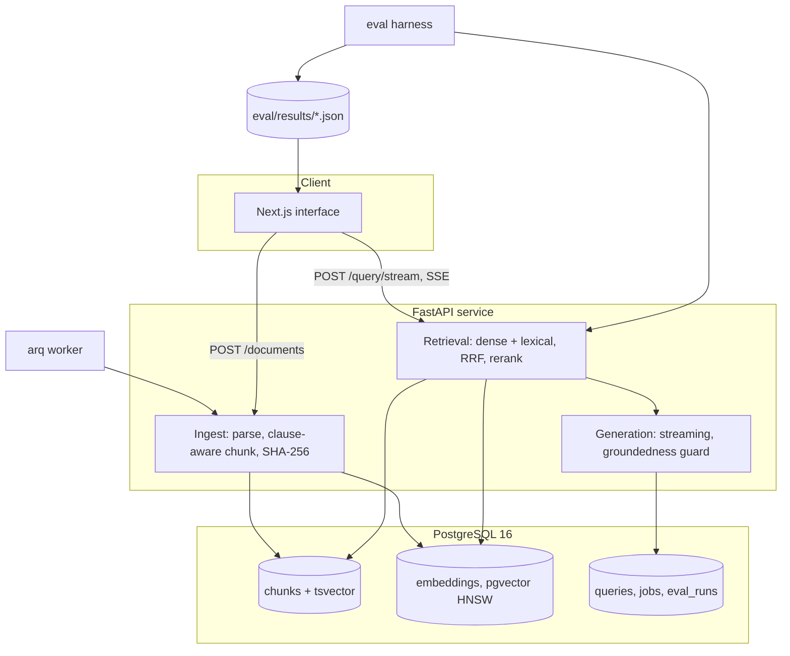

# ChainLens

ChainLens answers clause-level questions about supply-chain and logistics contracts --
vendor agreements, SLAs, distribution and freight contracts -- and returns the exact
character span in the source document that each answer came from. It is built for supply
chain and procurement analysts, legal operations and logistics managers who have to find
a liability cap or a termination notice period in a sixty-page agreement under time
pressure. It is a document audit instrument, not a chatbot.

The reason this repository exists is the evaluation harness. Retrieval systems are easy
to build and hard to justify, so every retrieval decision here is measured against a
committed golden set, and the results tables in this README and in `docs/RETRIEVAL.md`
are generated by a script from committed JSON artifacts rather than typed by hand.

## Origin

This began as a fork of a general-purpose RAG chatbot template built on LangChain,
Chroma and Streamlit. Version 2 replaces essentially all of it: the vector store is
PostgreSQL with pgvector, retrieval is a fused dense and lexical pipeline with an
evaluation harness attached, and the Streamlit interface is gone. The v1 retrieval
default, MMR at lambda 0.5, was kept only long enough to measure it, and the measurement
is why it is no longer the default. That result is in `docs/RETRIEVAL.md` with the
number attached.

## Results

<!-- eval:headline:start -->
Chunking fixed at `clause-aware`. Retrieval is scoped to the document the question is asked about.

| retrieval | Recall@3 | Recall@6 | Recall@10 | MRR | nDCG@10 | hit@6 | answer chars shown @6 | p50 ms | p95 ms |
|---|---|---|---|---|---|---|---|---|---|
| dense (pgvector cosine) | 0.565 | 0.673 | 0.728 | 0.604 | 0.601 | 0.764 | 0.725 | 81.8 | 89.7 |
| MMR (lambda 0.5) | 0.395 | 0.475 | 0.587 | 0.573 | 0.486 | 0.664 | 0.542 | 82.3 | 85.5 |
| lexical (Postgres FTS, ts_rank_cd) | 0.489 | 0.663 | 0.726 | 0.528 | 0.546 | 0.764 | 0.725 | 1.7 | 2.4 |
| RRF fusion (dense + lexical, k=60) | 0.582 | 0.677 | 0.756 | 0.601 | 0.614 | 0.754 | 0.730 | 81.1 | 85.9 |
| RRF fusion + glossary query expansion | 0.586 | 0.690 | 0.770 | 0.624 | 0.629 | 0.782 | 0.760 | 81.2 | 86.3 |
| RRF fusion + cross-encoder rerank | -- | -- | -- | -- | -- | -- | -- | -- | -- |
Cells marked `--` were not measured:
- cross-encoder weights could not be loaded: ModuleNotFoundError: No module named 'sentence_transformers' (3 configurations: `clause-aware__rrf_rerank`, `recursive-1024__rrf_rerank`, `recursive-512__rrf_rerank`)

Generated by `python -m eval.report` from 19 files in `eval/results/`. Runs produced at commit `b48878f962e7` (working tree dirty at run time) on 2026-08-02T08:14:54+00:00.

Dataset `eval/datasets/golden.jsonl`, sha256 `4ac8d01460a836c4`, 110 questions across 29 documents and 20 clause categories. Embedding provider `lsa-tfidf-svd-384` (dim 384); Postgres 16.2.

The embedding provider is not `bge-small-en-v1.5`: the model hub was unreachable in the environment these numbers were produced in, so a corpus-fitted LSA model was used instead. See ADR-0003. Absolute values are a floor for the architecture, not a claim about a modern encoder.
<!-- eval:headline:end -->

## Architecture



Request lifecycle for a question:

1. The query is expanded against a committed logistics glossary (`DDP` also searches for
   "delivered duty paid").
2. One query embedding is computed. The dense arm runs `ORDER BY embedding <=> query` on
   pgvector; the lexical arm runs `ts_rank_cd` over a generated `tsvector` column. Both
   are single SQL statements against the same table.
3. The two ranked lists are fused by reciprocal rank fusion at k=60.
4. If cross-encoder weights are available, the top 30 are reranked to the top 6.
   If they are not, the pipeline keeps fusion order and records in the trace that no
   rerank happened, so nothing downstream can claim one did.
5. The answer streams over SSE with phase events driven by measured backend timings.
   Every chunk carries `clause_id`, `page`, and exact character offsets, which is what
   lets the interface mark the cited span in the document rather than pointing at a page.
6. A row is written to `queries` with retrieval, rerank and generation milliseconds,
   token counts, estimated cost and the configuration hash.

## Structured extraction

Thirteen commercial fields are extracted with a character span attached to every value, and
a value whose span cannot be located in the source is dropped rather than emitted. Ten risk
rules run over the result from a committed YAML file.

Measured against 137 CUAD lawyer annotations across all 29 corpus documents: **micro
precision 0.722, recall 0.588, F1 0.648**, from
`eval/results/extraction__cuad.json`, regenerated by `python -m eval.run_extraction`.
Extraction here is pattern-based rather than model-based, which is a real compromise and is
argued in `docs/EXTRACTION.md` along with the three label mismatches that put a floor under
the score.

The most useful single output is not a field but a rule: `liability-cap-language-only`
fires on 25 of the 29 agreements, meaning almost every contract in this corpus limits
liability in words rather than in a figure. A portfolio-level exposure question cannot be
answered from these documents without reading them.

## Engineering decisions

**Clause-aware chunking, because the metric said so.** A 512-character recursive splitter
cuts a liability clause into three pieces, so the annotated answer is spread across
chunks and no single retrieval recovers all of it. Chunking on detected clause headings
is the largest single improvement in the ablation grid, larger than any retrieval change.
The tradeoff is that clause detection depends on document structure: on the OCR-derived
CUAD corpus only 417 of 1,509 chunks carry a detected clause id, and the strategy falls
back to recursive splitting when fewer than three headings are found. Measured in
`docs/RETRIEVAL.md`, backed by `eval/results/clause-aware__rrf.json` against
`eval/results/recursive-512__rrf.json`.

**MMR was removed after measurement, not before.** It was the headline retrieval decision
in v1. Measured against the golden set it is the worst configuration in the grid on
Recall@6 at all three chunking strategies, because diversity is the wrong objective when
the answer occupies one contiguous region of the document. The number is kept in the
table rather than deleted. Backed by `eval/results/clause-aware__mmr.json`.

**Lexical search stays inside Postgres.** A generated `tsvector` column with a GIN index
and `ts_rank_cd` gives a second retrieval arm with no second service to run, no second
thing to keep in sync, and a measured p50 under 2 ms. On this corpus it matches the dense
arm on Recall@6 while costing about one fortieth of the latency. It loses on MRR, which
is why both arms are fused rather than one being dropped.

**The cost is in the query embedding, not the vector search.** Decomposing retrieval
latency showed that Postgres does both searches and the fusion in single-digit
milliseconds while the query embedding accounts for roughly 95 percent of p50. That is
the number that decides where a latency budget goes, and it is the opposite of the
intuition that vector search is the expensive part. Backed by the `embed_ms_p50` and
`search_ms_p50` fields in every result file.

## Quickstart

Step-by-step instructions, including what to click and what will not work, are in
[`RUNNING.md`](RUNNING.md). The shortest path to seeing something is to open
`apps/web/prototype/evaluation.html`, which needs no install at all.

```bash
docker compose -f infra/docker-compose.yml up --build
curl localhost:8000/health
```

**This path is authored but unverified.** The environment this rebuild was performed in
had no Docker daemon, no root and no package manager, so `docker compose up` could not be
executed. Everything the service needs from Postgres was instead verified against a real
PostgreSQL 16.2 with pgvector 0.6.2, started in-process. The Docker-free path is:

```bash
pip install -e ".[dev,localpg]"
make migrate        # applies the Alembic baseline to a local PostgreSQL 16 with pgvector
make seed           # indexes three real supply-chain agreements so nothing is empty
make index eval     # builds the three chunking indexes and runs the ablation grid
make report         # regenerates every table in this repository from eval/results/
make check          # lint, types, tests, no-emoji, contrast, glossary parity
```

The web interface runs against a mock adapter with no backend at all:

```bash
cd apps/web && npm install && npm run dev
```

`docs/HANDOFF.md` records what was verified, what was not, and the verbatim errors.

## Reproducing the numbers

```bash
python -m eval.datasets.build_golden   # rebuild the golden set from CUAD
CHAINLENS_LOCAL_PG=1 python -m eval.run  # run the ablation grid
python -m eval.report                  # regenerate every table in this repository
python -m eval.gate                    # the CI regression gate
python -m eval.run_extraction          # field-level extraction accuracy
```

Every number in this README comes from a file in `eval/results/`. Configurations that
could not be measured render as a dash with the reason, never as a number.

## Documentation

| Document | Contents |
|---|---|
| `docs/ARCHITECTURE.md` | Module boundaries, data model, request lifecycle |
| `docs/RETRIEVAL.md` | Full ablation grid, methodology, and the negative results |
| `docs/EXTRACTION.md` | Extraction accuracy, the precision/recall trade, risk rule hit rates |
| `docs/DECISIONS.md` | Architecture decision records, including every compromise |
| `docs/taste-pass.md` | Interface direction, computed contrast ratios, build critique |
| `docs/PROGRESS.md` | What shipped per phase, with the command that proves it |
| `docs/HANDOFF.md` | Status per phase, what needs a human, honest weak spots |
| `eval/datasets/README.md` | Golden set provenance, licence, human and generated split |

## Licence

MIT, see `LICENSE`. The evaluation corpus under `eval/datasets/corpus/` is redistributed
from CUAD v1 by The Atticus Project under CC BY 4.0.
